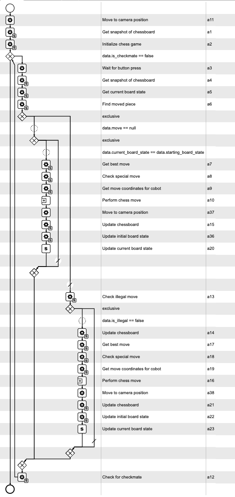

# Chess Game Recognition

This repository contains the core component of the Chess Project as part of for the TUM master lab "Advanced Practical Course - Sustainable Process Automation: Humans, Software and the Mediator Pattern (IN2128, IN2106, IN4303)".
The project implements a chess game recognition system using computer vision. The system captures a snapshot of the chessboard, processes the image to recognize the positions of chess pieces based on color, and then transform the coordinates, allowing a robot to interact with the chessboard. The game logic is integrated with Stockfish to determine the best possible moves, and provides RESTful services for each of the functionalities.
This repository solely contains the functionalities to process images, detect the chessboard/pieces, and to display and manage the current chessboard state. Other essential services are the following:
- [Stockfish-Service](https://github.com/kevi-nguyen/stockfish-service)
- [Button-Service](https://github.com/kevi-nguyen/button-service)
- [Intel RealSense Camera-Service](https://github.com/kevi-nguyen/intel-realsense-camera)


## Features
For the full demonstration video click [here](./demo/demo.mp4).


- **Color-Based Chessboard Recognition**: Identifies chess piece positions based on color (blue for white pieces and red for black pieces) and determines their positions on the board.
- **Chessboard Corner Detection**: Detects 4 green-marked chessboard corners.
- **Automatic Move Detection**: Tracks and identifies chess moves by comparing previous board states to the current one.
- **Chess Logic Mapping**: Validates chess moves, board states and identifies single pieces through parallel mapping with a virtual chessboard.
- **Robot Control**: Translates chess moves into robot coordinates to make physical movements on the chessboard.
- **Base64 Encoded Image Processing**: The recognition system expects a chessboard image encoded in Base64 format and will decode it and further operate on it.

(See linked repositories)
- **Stockfish Integration**: Utilizes Stockfish to compute the best move for the robot after each player move.
- **Button Integration**: Recognizes physical button input to signal the robots turn.
- **Camera Snapshot Input**: Initializes a coloured video stream pipeline to get snapshots from the chessboard upon requests.

**API-Endpoints**:

There will be several RESTful endpoints exposed which can be called to recognize and manage the board state.

1. '/update_chessboard'
	•	Updates the chessboard state based on a provided FEN string and move.

2. '/check_illegal_move'
	•	Verifies if a move is illegal given the current FEN string and move.

3. '/check_game_end'
	•	Checks if the game has reached an end condition, such as checkmate, using the current FEN string.

4. '/get_move'
	•	Compares two board states and identifies the moved piece.

5. '/update_board_state'
	•	Updates the board state with blue and red pieces using the current board string, a move, and any special conditions (like castling).

6. '/check_special_move'
	•	Checks if the given move is a special move (e.g., castling, en passant) using the current FEN string.

7. '/get_cobot_move'
	•	Converts the chess move coordinates into a move format suitable for the robot, considering special conditions like orientation and coordinates to put the captured pieces.

8. '/get_board_state'
	•	Processes an image of the chessboard, transforms it based on provided points, and returns the detected board state.

9. '/initialize_game'
	•	Initializes the game by processing an image to detect the chessboard corners and determine the starting orientation and state.


## Requirements

The project dependencies (requirements.txt) can be installed using `pip`:

```
opencv-python
opencv-python-headless
python-chess
fastapi
uvicorn
numpy
requests
chess
pydantic
python-multipart
```
Additional Requirements
- Chess Pieces: The pieces should be colored blue and red to represent white and black pieces, respectively.
- Chessboard Corners: Use green markers for the corners of the chessboard. These are mandatory to recognize the chessboard accurately.
- Image Orientation: The snapshot of the camera must be adjusted so that the defined “bottom” orientation aligns with the bottom side of the image. The “bottom” refers to the side where the player stands (the opposite side of the robot side). As you can see [here](./demo/demo_orientation.gif).
  To do that you can rotate the camera output in the camera service:
   ```python
   rotated_image = cv2.rotate(rgb_frame, cv2.ROTATE_90_CLOCKWISE)
   ```
   After correctly adjusting the camera output you are able to set up the pieces the way you like - the recognition system will automatically recognize where the blue/white side is and adjust the coordinates for the cobot accordingly. So you can play from left to right, top to bottom, whatever you prefer.

Prerequites for a full chess game with this repository
- Button: A physical button is used to signal the robot its turn.
- Robot Arm: A robotic arm is used to interact with the chess pieces.
- Intel RealSense Camera: Ensure that an Intel RealSense camera is used for capturing the chessboard and pieces.
- Process Engine: An orchestrating process engine is required to manage the interactions between the provided services and the robot. Have a look at the [Model](./CPEE_model) folder to get an insight of the chess game process

## Installation

1. **Clone the Repository**:
   ```bash
   git clone https://github.com/kevi-nguyen/chess-game-recognition.git
   cd chess-game-recognition
   ```

2. **Install Dependencies**:
   Activate your virtual environment and install the required dependencies from the `requirements.txt` file.
   ```bash
   pip install -r requirements.txt
   ```

4. **Run the Service**:
   To start the chess game recognition services, use the following command:
   ```bash
   python Chessboard-API.py
   ```
   This will start the FastAPI service on `http://0.0.0.0:8081`.

## Overview of the Game Structure

The chess game recognition system works through the following steps:

1. **Snapshot Capture**: A snapshot of the chessboard is taken using a camera and encoded in Base64 format.
2. **Corner Detection**: The image (the decoded Base64 string) is processed to detect the green-marked corners of the chessboard. This establishes the coordinates of the chessboard in the image. Now the image can be transformed and mapped to the chessboard corners.
3. **Chessboard Mapping**: Once the corners are detected, the board is divided into 64 squares. Each square can be analyzed to detect whether a blue or red chess piece is present (blue for white pieces, red for black pieces).
4. **Player moves**: The player makes a move and signals the end of the move by pressing on the button (or if it is the start of the game: the player can skip the move and press the button - in this case the robot will begin as blue/white).  
5. **Board State Management**: The initial board state is tracked, and the system continuously updates the board state by comparing the initial state to the current state after each player's move. Concurrently, a virtual chessboard is tracked with the actual pieces. In that way it always knows which piece is on which square.
6. **Move Detection**: When the player makes a move, the system compares the previous board state with the current one to detect which piece was moved. After the board state and the virtual chessboard are updated accordingly, the current FEN string is sent to Stockfish to get the best response.
7. **Robot Move Execution**: After Stockfish computes the best move, the system transforms the chess move into robot coordinates (i, j) and sends these to the robot to execute the move. The robot will execute a move subprocess and performs the desired move.
8. **Cycle Repeats**: The player moves again and presses a button to signal the end of their move, a new snapshot is taken, and the process starts again.

This whole process is visualized in the CPEE model:



## Color Recognition

### Image Processing Pipeline

The system employs an advanced image processing pipeline to ensure accurate detection of blue and red chess pieces, even under varying lighting conditions. The process is divided into several stages:

1. **Multi-Scale Retinex with Color Preservation**:
   The image is pre-processed using a technique called Multi-Scale Retinex with Color Preservation (MSRCP) to maintain color constancy. This reduces the effect of lighting variations on color detection. Gaussian blur, histogram equalization, and other operations are applied to enhance image quality.
   
   Example of converting to HSV color space and applying histogram equalization:
   ```python
   # Convert the image to HSV color space
   image_hsv = cv2.cvtColor(image, cv2.COLOR_BGR2HSV)

   # Apply histogram equalization to the V channel
   image_hsv[:, :, 2] = cv2.equalizeHist(image_hsv[:, :, 2])
   ```

2. **Masking and Color Segmentation**:
   For detecting specific colors (blue and red in this case), the system computes histograms for each HSV channel, focusing on the predefined hue range for each color. The histogram data is then used to create a mask that isolates the regions of the image containing the target color.

   Example:
   ```python
   # Compute histograms for HSV channels
   h_hist, s_hist, v_hist = self.compute_histogram(image_hsv, color_name)

   # Determine HSV ranges for the specified color
   lower_bound, upper_bound = self.determine_hsv_ranges(h_hist, s_hist, v_hist, color_name)

   # Create a mask based on the HSV color range
   mask = cv2.inRange(image_hsv, lower_bound, upper_bound)
   ```

3. **Morphological Operations**:
   After masking, the system applies morphological operations (like erosion and dilation) to clean up the mask, removing noise and enhancing the regions that represent chess pieces.
   
   ```python
   # Apply morphological operations to clean the mask
   mask = cv2.morphologyEx(mask, cv2.MORPH_CLOSE, kernel)
   ```

4. **Analyzing Chess Piece Colors**:
   Once the masks are generated, the system analyzes the image to locate blue and red pieces based on the dynamically predefined HSV ranges. This allows the system to determine the position of each piece on the board.
